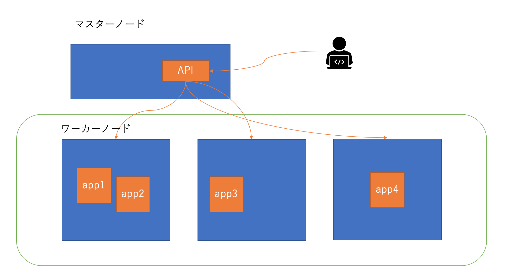
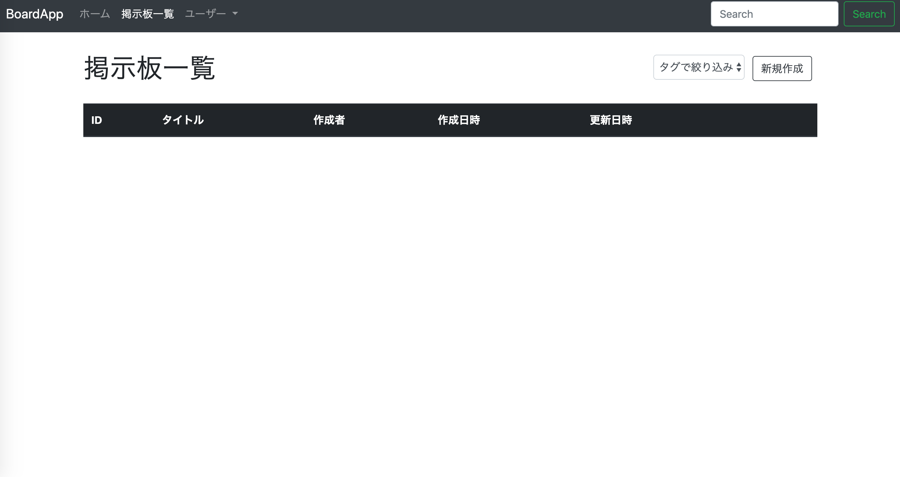
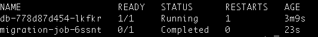
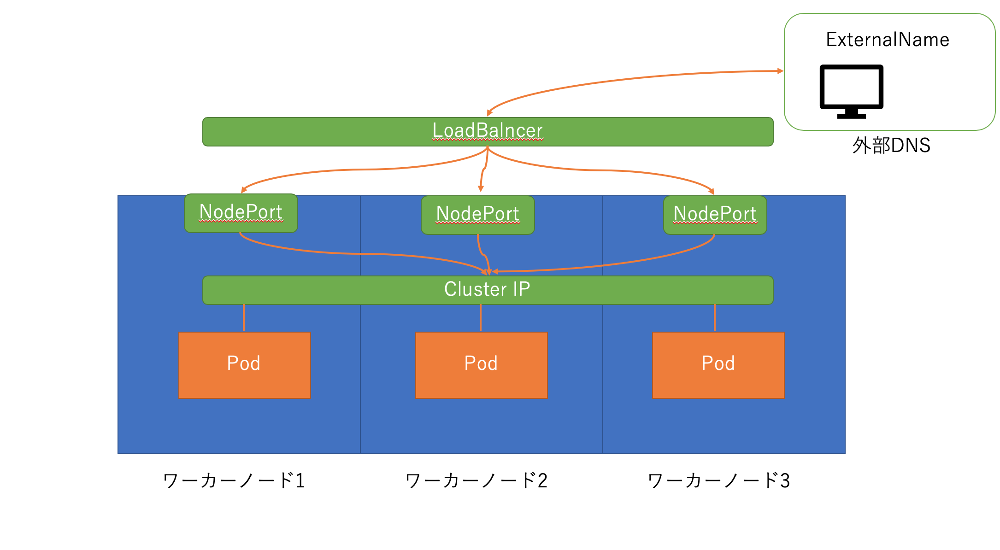

# Kubernetes the soft way 
このリポジトリはKubernetesの初心者や経験の少ない人がレベルアップするためのハンズオン資料です。実行環境を作成していち早くアプリケーションを動作させたい場合は『Kubernetesクラスターにアプリケーションをデプロイする』に進んでください。一つ一つのコンポーネントの役割を学びながらアプリケーションをデプロイしたい人は『Kubernetesクラスターにアプリケーションをデプロイする』と『各コンポーネントの説明』を交互に参照しながら進めてください。  

## 目次  
- 対象者と説明することしないこと  
- 実行環境  
- Kubernetesの概要
- Kubernetesクラスターにアプリケーションをデプロイする  
- 各コンポーネントの説明  
- リソースのクリーンアップ  

## 対象者と説明することしないこと  
### このチュートリアルの対象者  
- Dockerについての基礎的な知識があること  
- kubernetes上でNginxだけでなく、本格的なアプリケーションを動作させてみたい人  
### 説明すること  
- Kubernetesのアーキテクチャの概要  
- Kubernetesリソース(Pod,Serviceなど)

### 説明しないこと
- 内部の詳細なアーキテクチャ(kube-apiserver,etcdなど)  
- kubectlコマンドの詳細な説明

## 実行環境  
- [docker desktop](https://www.docker.com)  2.1.0.2
- kubectl  1.14.6  

## Kubernetesの概要  
### Kubernetesとは
Kubernetesはコンテナ化されたアプリケーションのためのオーケストレーションシステムです。最初はGoogleによって開発されていましたが、現在ではCNCF(Cloud Native Computing Fundation)のもとでオープンソースプロジェクトととして開発が進められています。また、オープンソース版でのKubernetesだけでなく、GCPが提供するGKEやAWSのEKSなど様々なクラウドベンダーによってフルマネージドなKubernetesサービスが提供されています。  

### Kubernetesの構成図  
  
### マスターノード  
コンテナ化されたアプリケーションのデプロイやスケジューリングはマスターノードを介して行われる。

### ワーカーノード
アプリケーションが動作する環境。運用者がワーカーと直接やり取りすることはなく、マスターを介して行われる。  

### Kubernetesリソース  
Kubernetesでアプリケーションを構成するための基本的なリソースは以下の通りです。  
- Pod  
  Podは1つ以上のコンテナから構成される。またPod単体にはレプリケーションや世代管理の機能は備わっていないので、ReplicaSetやDeploymentを利用する。
- Service(ClusterIP,ExternalName,NodePort,LoadBalancer)  
  Podにはアプリケーションを外部に公開したり、他のPodと通信したりする機能はないので、Serviceを利用する必要がある。  
- Volume  
  コンテナアプリケーションは運用の過程で削除や作成を繰り返し行う。しかし、コンテナ自身は揮発性なのでデータを永続化することができない。したがって、ワーカノードから論理的に切り出したボリュームにデータを永続化する必要がある。その仕組みを提供するのがVolume。
- NameSpace  
  1つのKubernetesクラスターを論理的に分離し、複数の用途で利用できるようにする仕組み。例えば、開発環境用、本番環境用のクラスターを一つのKubernetesクラスターでまかなうことができる。


## Kubernetesクラスターにアプリケーションをデプロイする   

```
$ git clone https://github.com/takapon564/KubernetesFromZeroToHero.git  

$ cd KubernetesFromZeroToHero  

# データベースのデプロイ(Persistence Volume,Deployment, Service)
$ kubectl apply -f manifest/database/

# 環境変数のConfigMapを展開(configMap)
kubectl apply -f manifest/configuration/

# データベースのマイグレーション(Job)
$ kubectl apply -f manifest/migrate/

# アプリケーションのdeploy(Deployment, Service)
$ kubectl apply -f manifest/application/

# ingressコントローラーの有効化(Service, Deployment, Ingress)
$ matsuuratakahito$ ./ingress-controller-setup.sh

# アプリケーションを外部に公開するためのservice設定(Service, Ingress, Deployment)
$ kubectl apply -f manifest/service/
```  

ブラウザで`localost`にアクセス  
  


## 各リソースの説明  
### Deployment, Persistence Volume  
データベースのデプロイでは`volumes.yml`でデータを永続化するためのボリュームを作成しました。実際に切り出された論理空間が`PersistentVolume`であり、それに対する細かい仕様を定義したのが`PersistentVolumeClaim`です。
データベースはDeploymentとして定義されています。`rest-web-db.yml`の44行目で事前に作成したボリュームを使用するよう宣言しています。また、他のPodと通信できるようにClusterIP型のServiceを定義してます。**ClusterIPは外部に公開されることはなく、他のPodと通信するため**に利用されます。

### ConfigMap  
コンテナアプリケーションは環境変数をコンテナないに埋め込むことができます。しかし、環境が変わると環境毎に環境変数を変更しイメージを再作成しなければいけません。複数のアプリケーションで参照する環境変数を共有する仕組みが`ConfigMap`です。`manifest/configuration/app-config.yml`にはDBのパスワードやユーザー名が記述されており、複数のPodからこれを参照することができます。`rest-web-app.yml`の33行目の`envFrom`で｀`manifest/configuration/app-config.yml`で作成した環境変数を参照しています。


### Job  
一般的にPodは起動したら、以上がない限り稼働し続けますがDBのマイグレーションなどのバッチ的な処理を走らせたい場合があるかもしれません。そのような時に使うのがJob/CronJobです。`manifest/migrate/migration.yml`はデプロイされたDBにマイグレーションを行なっています。この処理はPodとして行われ正常に実行されると、`completed`の状態になります。`migration.yml`を適用した後に`kubectl get po`を実行してみてください。Jobが正常に動作していれば、次のようになっているはずです。  
  

念のために`kubectl logs <JobのPod名>`を実行してコンテナの実行ログを出力してみましょう。  

```
Created database 'app_development'
Created database 'app_test'
== 20181108203446 CreateBoards: migrating =====================================
・
・
<省略>
・
・
== 20190803014636 AddBirthdayToUser: migrating ================================
-- add_column(:users, :birthday, :date)
   -> 0.1436s
== 20190803014636 AddBirthdayToUser: migrated (0.1437s) =======================

Model files unchanged.
```


### Service, Ingress  
rails製アプリケーションのデプロイが完了したら最後にServiceを使ってアプリケーションを公開します。ここでServiceの一覧を確認しましょう。  
  
#### ClusterIP  
レプリケーションされたPodに仮想IPとサービス名を提供します。ClusterIPはServiceを公開するための機能はないので、Serviceを後悔する場合、LoadBalancerやIngressと併用する必要があります。
#### NodePort  
Serviceタイプに`NodePort`を指定すると各ワーカーノードの同じポートにServiceを公開することができます。

#### LoadBalancer  
クラウドプロバイダーが提供するサービスを利用してコンテナを外部に公開します。LoadBalancerは各ベンダーのサービスによって異なるのでドキュメントを参照してください。
#### ExternalName  
ExternalNameはServiceと外部のDNS名を紐付けします。クラスターのアプリが外部に依存していると外部に変更があった場合に修正が大変ですが、ExternalNameを使うことでシステムを疎結合化することができ、修正を最小限にすることができます。以下では`my-app`というServiceを`example.com`に紐づけています。   

```
apiVersion: v1
kind: Service
metadata:
  name: my-app
  namespace: prod
spec:
  type: ExternalName
  externalName: example.com
```
#### Ingress 
これまで説明してきた各ServiceはL3,L4での通信を行なうものでしたが、**Ingress**はL7(http/https)での通信を行います。IngressIngressは環境によってことなりますが、ここではKubernetesが標準でサポートしているnginx ingress controllerを利用しています。

## リソースのクリーンアップ  

```
$ kubectl delete  -f manifest/database/

$ kubectl delete  -f manifest/configuration/

$ kubectl delete  -f manifest/application/

$ kubectl delete  -f manifest/migrate/

$ kubectl delete  -f manifest/service/
```
